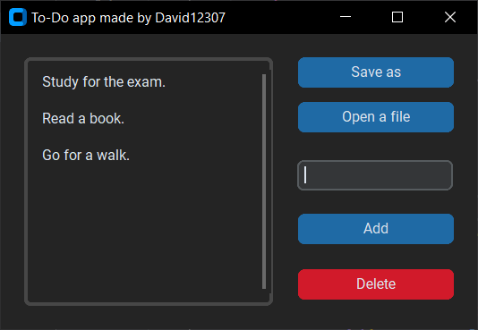

# Python GUI To-Do Application
This is a simple GUI To-Do application that I made while exploring the GUI world.

## Features
- **Add Tasks**: You can add tasks to your to-do list by typing them into the input field and pressing the "Add" button or the "Enter" key.
- **Delete Tasks**: To remove a task from the list, select it and press the "Delete" button. If you haven't selected a task the application will show a pop-up window telling you to do it.
- **Open files**: You can load tasks from text files but not in any format (a line and a task)
- **Save tasks**: You can save tasks in your computer to load another time but if you modify anything in the file you'll risk to break it.

## Usage
1. Enter a task in the input field.
2. Press the "Add" button or the "Enter" key to add the task.
3. To delete a task, select it and click the "Delete" button.
4. To load tasks from a file, click on 'Open a file' and select the file that contains the tasks.
5. To save your to-do list, click 'Save as' and choose where to story it and under what name.

## How to run
* Ensure you have python installed on your computer.
* Clone this repository or just copy the `main.py` file.
* Run the application by executing `py script.py`.

! This was made using the 'Custom Tkinter' library (combined with Tkinter for the load/save files system) so the widgets are much more appealing.
## David12307
